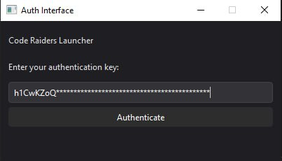
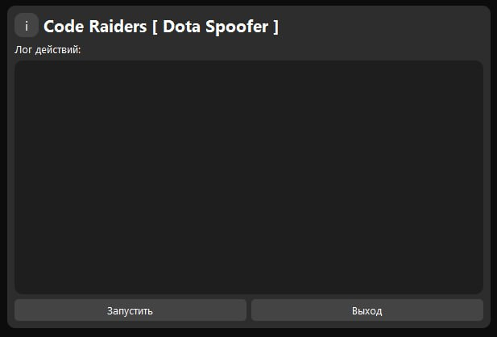
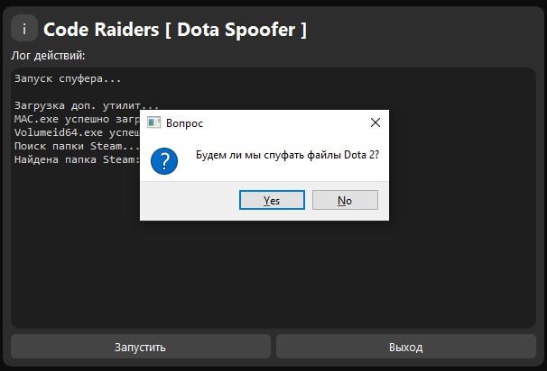
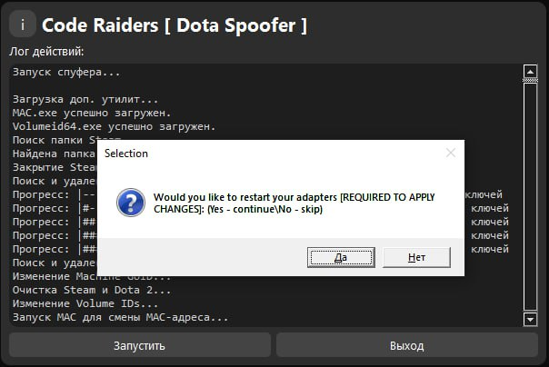
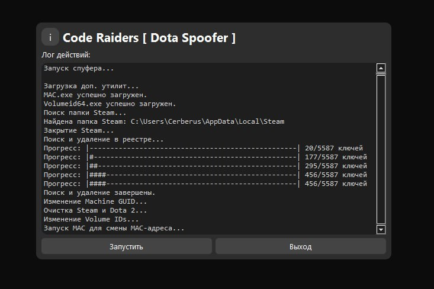

# Гайд по использованию спуфера для Dota 2

Этот гайд предназначен для тех, кто столкнулся с баном, меняет аккаунт для буста/дебуста, руина, использования стороннего ПО, и т.д. Спуфер поможет избежать наказаний на другие аккаунты Steam при переходе между ними.

## Инструкция

### 1. Запуск лоадера
1. Откройте лоадер **Code Raiders**.
2. Введите ключ продукта.
3. После активации откроется меню спуфера.
4. Нажмите кнопку **"Запустить"**.

  
  

### 2. Настройка пути
Спуфер автоматически определяет пути к Steam и Dota 2. Если этого не произошло:
- Укажите пути вручную:
  - Путь к папке Steam (обычно `C:\Program Files (x86)\Steam`).
  - Путь к папке Dota 2 (обычно `C:\Program Files (x86)\Steam\steamapps\common\dota 2 beta`).

  

### 3. Выбор действий
Если вы:
- Получили бан;
- Использовали стороннее ПО;
- Или хотите полностью очистить следы предыдущей активности —

На вопрос **"Будем ли мы спуфать файлы Dota 2?"** отвечайте **Да**.

Если вы просто хотите безопасно перемещаться между аккаунтами:
- Нажмите **Нет**.

  

### 4. Изменение MAC-адреса и сетевых драйверов
1. В консоли появится текст:  
   `Запуск MAC для смены MAC-адреса...`
2. На вопрос **"Перезапускать ли сетевые драйвера?"** выберите **Да**.
3. Дождитесь завершения работы спуфера. Если спуф прошел успешно:
   - Программа закроется автоматически.

  

### 5. Перезагрузка компьютера
После завершения работы спуфера:
1. Перезапустите компьютер.

### 6. Проверка Steam
После перезапуска компьютера:
1. Откройте Steam.
2. Если вы получили ошибку **"Сервисы Steam не установлены"**:
   - Нажмите кнопку **"Установить сервисы"**.
   - Если сервисы не установились, переустановите Steam (редко требуется, обычно на новых версиях Windows).

### 7. Проверка файлов Dota 2
Если вы спуфали файлы Dota 2:
1. Перейдите в библиотеку Steam.
2. Нажмите правой кнопкой мыши на Dota 2 → **Свойства** → **Локальные файлы** → **Проверить целостность файлов**.

Если вы **не спуфали файлы Dota 2**, этот шаг можно пропустить.

---

## Готово!
Теперь можно безопасно заходить в игру и наслаждаться Dota 2 без риска получить наказание на другие аккаунты.

---

### Важно:
- Спуфер нужно использовать только при необходимости!
- Всегда следите за актуальной версией лоадера и спуфера.
